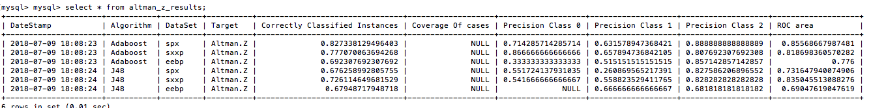

```{r setup, include=FALSE}
knitr::opts_chunk$set(echo = TRUE)
```

# M\&M - Classification
Created a new dataset, as a copy of the orignal but subsetting to include only variables listed in Appendix A of the orginal paper. Run classification results again and compare to non-subsetted dataset. 

```{r, echo=FALSE, fig.cap="PSM testing - Asset", out.width = '100%'}

```


# M\&M - Regression
Taking same data, but not thresholding on dependent variables leaving it as a regression problem. Imputing (multiple, m=5) the data using the mice package. Lasso wont work on data with missing values. Running with just complete cases is an option, but could introduce bias? Also, zero rows in eebp are complete, very small number in sxxp. Tried for complete cases in spx (56 rows).

All results in table 3.    

Included in those results is a regression on the Beneish MScore, which is a measure of how likely it is that the reported earnings of the company have been manipulated. Results are poor in terms of R^2. There is room for more work here (other dependent variables, and include in causal analysis as described below.)

\clearpage

# Causality
## akelleh

### Methodology - Causal Estimation

M&M make 8 statements about the effects of various corporate governance features on either Tobins Q or the Altman Z Score. This is the basis for my work on causal estimation, following this guide - [https://github.com/akelleh/causality/tree/master/causality/estimation](https://github.com/akelleh/causality/tree/master/causality/estimation). The goal is to pick a treatment and outcome, and measure the magnitude of the effect of the former on the latter. Uses propensity matching. 

I've built a MySQL table per statement to test. The manipulations I carry out to prepare each are: 

* Impute the data to remove missing values. Taking just complete cases is infeasable especially for sxxp and eebp data-sets, since there are so few cases without missing data.  

* Scale all columns apart from the treatment and target. Speeds up algorithm run-time. Leaving treatment and target as-is so that the resulting estimated causal effect is in the same units. 


Called using something like;

```{r eval=FALSE}
ATE_results = matcher.estimate_ATE(
  data, 
  treatment, 
  target, 
  {'P.B': 'c', 'Asset':'c', 'Tax':'c', 'P.E':'c'}, #to control for 
  bootstrap=True
)
```

The main issue is how to pick out variables to control for. When I control for all in the dataset, I get an error about perfect separation in the matching stage. 

Results for each of M&M's statements are in table 4. 

My analysis also includes some plotting to show how good the matching process was, in terms of overlap in 1-D between the test and control groups. They need to overlap on the x axis. I think this is a good way to show whether propensity score matching is valid using those variables, but I can't just try every combination to see how the matching performs (I don't think?). Diagrams such as \<over the page\>. I need to find a better way to pick these variables, presumably by picking out ones that are marked as important in the literature? Could also use those marked as important in the classification / regression phase? 


\clearpage

```{r, echo=FALSE, include=FALSE}
library(RMySQL)
library(knitr)
library(kableExtra)
```


```{r, echo=FALSE}
mydb <- dbConnect(MySQL(), user='root', password='', dbname='mm_results')
results.tobin <- dbReadTable(conn=mydb,name='tobin_q_results')
results.altman <- dbReadTable(conn=mydb,name='altman_z_results')
results.tobin$DateStamp <- NULL
results.altman$DateStamp <- NULL

kable(results.tobin, caption="MM Classification Results - Tobins Q as target") %>%
  kableExtra::landscape()

kable(results.altman, caption="MM Classification Results - Altman Z as target") %>%
  kableExtra::landscape()

```


```{r, echo=FALSE}
mydb <- dbConnect(MySQL(), user='root', password='', dbname='regression_results')
glmnet.results <- dbReadTable(conn=mydb,name='glmnet_results')

kable(glmnet.results, caption="Reg. Regression using Lasso Results") %>%
  kableExtra::landscape()

```


```{r, echo=FALSE}
mydb <- dbConnect(MySQL(), user='root', password='', dbname='causal_results')
akelleh.results <- dbReadTable(conn=mydb,name='akelleh_results_latest')

kable(akelleh.results, caption="akelleh Estimation Results") %>%
  kableExtra::landscape()

```

